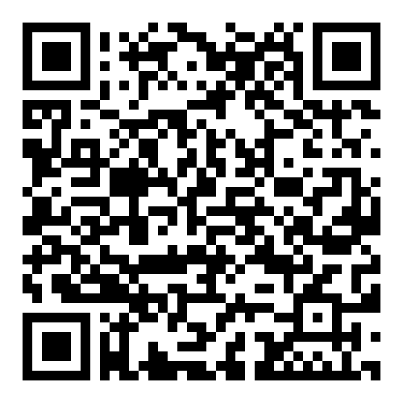

# 仮配属ゼミ(5年12月7日)

> バール・シュテファン (Stefan Baar)

## トマトの Monocular depth estimation (Midas)

"Monocular depth estimation (Midas)" 推定を使用して前景オブジェクトと背景オブジェクトを区別します。

Run:
- git clone <https://github.com/StefanBaar/Kari-haizoku-zemi>
- cd Kari-haizoku-zemi
- jupyter notebook or vscode

or read at:

- [5年12月7日 トマトの Monocular depth estimation (Midas) notebook](depth_estimation.ipynb)

## トマト - 検出 - 追跡

このノートブックでは、yoloV8 を使用して個々のトマトを検出および追跡する簡単な手順を説明します。
インスタンスの分割には、「YOLOv8x-seg」に基づく事前トレーニング済みモデルが使用されます。 モデルは少数の画像のみでトレーニングされています。 ただし、トレーニングおよび検証のデータセットは、幾何学的拡張によって拡張されています。
ノートブックを実行するには次のモジュールが必要です。

Run:
- git clone https://github.com/StefanBaar/Kari-haizoku-zemi
- cd Kari-haizoku-zemi
- jupyter notebook or vscode

or read at:
- [5年11月16日 トマト 検出 追跡 notebook](tomato_detection_tracking.ipynb)

Task:
- 全てのフレームを通して、3つのトマトを追跡します。
- no False Positives/Negatives (0FN / 0FP)

https://github.com/StefanBaar/Kari-haizoku-zemi/assets/6949138/6b212246-a26e-45ef-9734-bbe99ca9b6c0

## さらに詳しい情報

Yolo V8 について：
- https://github.com/ultralytics/ultralytics

Instance segementation について：

- https://docs.ultralytics.com/tasks/segment/

Object tracking:

- https://docs.ultralytics.com/modes/track/#why-choose-ultralytics-yolo-for-object-tracking

- Bot-SORT: https://github.com/NirAharon/BoT-SORT

- ByteTrack: https://github.com/ifzhang/ByteTrack

model training について：

- https://docs.ultralytics.com/modes/train/#why-choose-ultralytics-yolo-for-training

